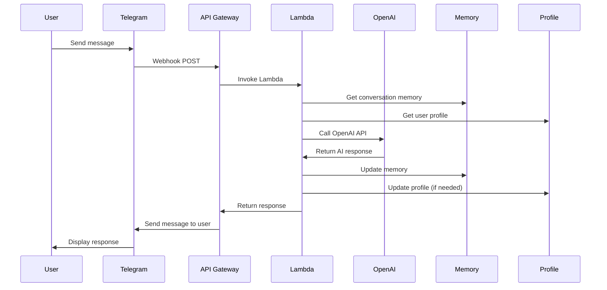
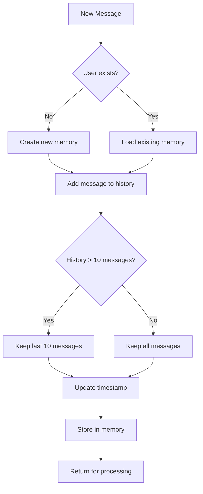
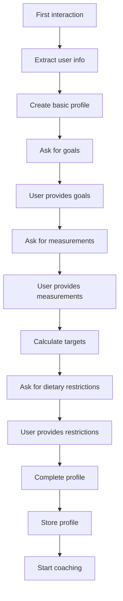
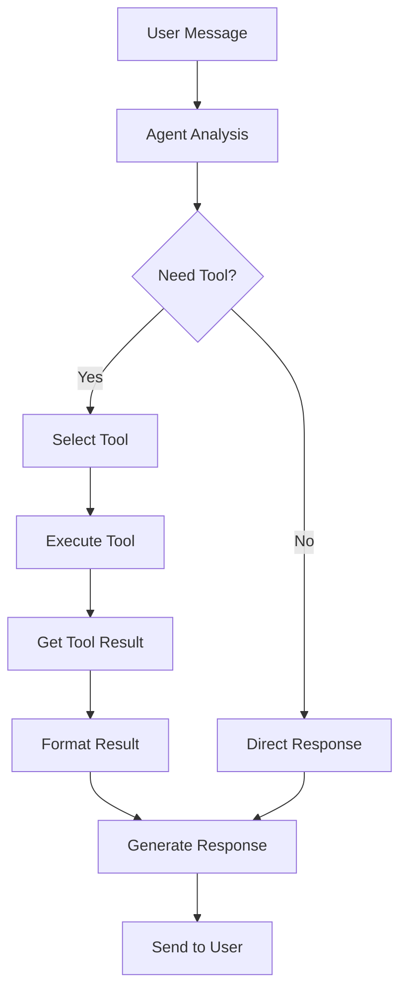
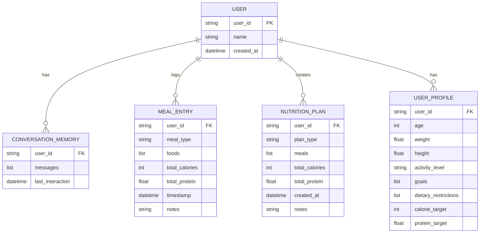
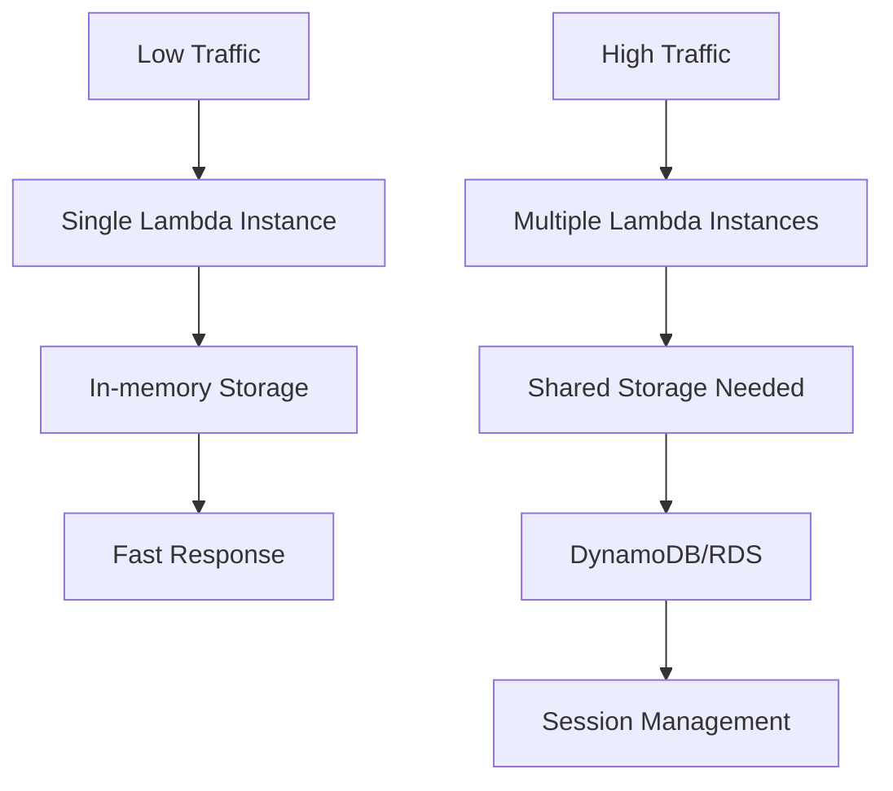

# NutritionGPT Coach v2.0 - Architecture Diagrams & Technical Details

## 🏗️ **System Architecture Overview**

### **High-Level Architecture**
```
┌─────────────────────────────────────────────────────────────────┐
│                        USER INTERFACE                           │
│  ┌─────────────────┐  ┌─────────────────┐  ┌─────────────────┐  │
│  │   Telegram      │  │   Web App       │  │   Mobile App    │  │
│  │     Bot         │  │   (Future)      │  │   (Future)      │  │
│  └─────────────────┘  └─────────────────┘  └─────────────────┘  │
└─────────────────────────────────────────────────────────────────┘
                                │
                                ▼
┌─────────────────────────────────────────────────────────────────┐
│                      API GATEWAY                               │
│  ┌─────────────────┐  ┌─────────────────┐  ┌─────────────────┐  │
│  │   Webhook       │  │   REST API      │  │   GraphQL       │  │
│  │   Endpoint      │  │   (Future)      │  │   (Future)      │  │
│  └─────────────────┘  └─────────────────┘  └─────────────────┘  │
└─────────────────────────────────────────────────────────────────┘
                                │
                                ▼
┌─────────────────────────────────────────────────────────────────┐
│                      AWS LAMBDA                                │
│  ┌─────────────────────────────────────────────────────────────┐  │
│  │              NUTRITION COACH CORE                           │  │
│  │  ┌─────────────┐  ┌─────────────┐  ┌─────────────┐        │  │
│  │  │ Conversation│  │   User      │  │   Meal      │        │  │
│  │  │   Memory    │  │  Profiles   │  │  History    │        │  │
│  │  └─────────────┘  └─────────────┘  └─────────────┘        │  │
│  │                                                             │  │
│  │  ┌─────────────┐  ┌─────────────┐  ┌─────────────┐        │  │
│  │  │   AI Agent  │  │ Nutrition   │  │   Proactive │        │  │
│  │  │   Tools     │  │ Knowledge   │  │  Messaging  │        │  │
│  │  └─────────────┘  └─────────────┘  └─────────────┘        │  │
│  └─────────────────────────────────────────────────────────────┘  │
└─────────────────────────────────────────────────────────────────┘
                                │
                                ▼
┌─────────────────────────────────────────────────────────────────┐
│                    EXTERNAL SERVICES                           │
│  ┌─────────────────┐  ┌─────────────────┐  ┌─────────────────┐  │
│  │   OpenAI API    │  │   Vector DB     │  │   Storage       │  │
│  │   (GPT-4)       │  │   (Chroma)      │  │   (DynamoDB)    │  │
│  └─────────────────┘  └─────────────────┘  └─────────────────┘  │
└─────────────────────────────────────────────────────────────────┘
```

## 🔄 **Data Flow Diagrams**

### **1. Message Processing Flow**


### **2. Conversation Memory Management**


### **3. User Profile Creation Flow**


## 🧠 **AI Agent Architecture (LangChain Version)**

### **Agent System Overview**
```
┌─────────────────────────────────────────────────────────────┐
│                    AI AGENT SYSTEM                          │
├─────────────────────────────────────────────────────────────┤
│                                                             │
│  ┌─────────────┐    ┌─────────────┐    ┌─────────────┐     │
│  │   Input     │───►│   Agent     │───►│   Output    │     │
│  │  Processor  │    │  Executor   │    │  Generator  │     │
│  └─────────────┘    └─────────────┘    └─────────────┘     │
│         │                   │                   │           │
│         ▼                   ▼                   ▼           │
│  ┌─────────────┐    ┌─────────────┐    ┌─────────────┐     │
│  │   Memory    │    │   Tools     │    │   Response  │     │
│  │  Manager    │    │  Registry   │    │  Formatter  │     │
│  └─────────────┘    └─────────────┘    └─────────────┘     │
│                                                             │
└─────────────────────────────────────────────────────────────┘
```

### **Tool Execution Flow**


## 📊 **Data Models & Relationships**

### **Entity Relationship Diagram**


## 🔧 **Component Details**

### **1. Conversation Memory System**
```python
# Memory Structure
{
    "user_id": "12345",
    "messages": [
        {"role": "user", "content": "I want to build muscle"},
        {"role": "assistant", "content": "Great! Let's set up your profile..."},
        {"role": "user", "content": "I'm 180 lbs, 6'0\""},
        {"role": "assistant", "content": "Perfect! For muscle building..."}
    ],
    "last_interaction": "2025-07-24T10:30:00Z",
    "context": {
        "current_goal": "muscle_building",
        "profile_complete": False,
        "last_meal": "2 hours ago"
    }
}
```

### **2. User Profile Schema**
```python
# Profile Structure
{
    "user_id": "12345",
    "name": "John",
    "age": 25,
    "weight": 180.0,
    "height": 72.0,
    "activity_level": "moderate",
    "goals": ["build_muscle", "lose_fat"],
    "dietary_restrictions": ["vegetarian"],
    "calorie_target": 2200,
    "protein_target": 150.0,
    "preferences": {
        "meal_frequency": 4,
        "cooking_time": "30min",
        "budget": "medium"
    },
    "created_at": "2025-07-24T10:00:00Z",
    "updated_at": "2025-07-24T10:30:00Z"
}
```

### **3. Meal Entry Structure**
```python
# Meal Entry Structure
{
    "user_id": "12345",
    "meal_type": "lunch",
    "foods": [
        {"name": "grilled chicken", "calories": 180, "protein": 35},
        {"name": "brown rice", "calories": 110, "protein": 2},
        {"name": "broccoli", "calories": 30, "protein": 3}
    ],
    "total_calories": 320,
    "total_protein": 40,
    "timestamp": "2025-07-24T12:00:00Z",
    "notes": "Good protein content for muscle building"
}
```

## 🚀 **Deployment Architecture**

### **AWS Infrastructure**
```
┌─────────────────────────────────────────────────────────────┐
│                    AWS CLOUD                                 │
├─────────────────────────────────────────────────────────────┤
│                                                             │
│  ┌─────────────┐    ┌─────────────┐    ┌─────────────┐     │
│  │   API       │    │   Lambda    │    │   CloudWatch│     │
│  │  Gateway    │◄──►│   Function  │◄──►│    Logs     │     │
│  └─────────────┘    └─────────────┘    └─────────────┘     │
│         │                   │                   │           │
│         ▼                   ▼                   ▼           │
│  ┌─────────────┐    ┌─────────────┐    ┌─────────────┐     │
│  │   DynamoDB  │    │   S3        │    │   IAM       │     │
│  │   (Future)  │    │   (Future)  │    │   Roles     │     │
│  └─────────────┘    └─────────────┘    └─────────────┘     │
│                                                             │
└─────────────────────────────────────────────────────────────┘
```

### **Lambda Function Structure**
```python
# Lambda Handler Flow
def lambda_handler(event, context):
    # 1. Extract Telegram update
    update = event
    
    # 2. Initialize bot
    bot = TelegramNutritionBot(telegram_token, openai_api_key)
    
    # 3. Process message
    result = bot.handle_message(update)
    
    # 4. Return response
    return {
        "statusCode": 200,
        "body": json.dumps(result)
    }
```

## 📈 **Performance & Scaling**

### **Lambda Performance Metrics**
```
┌─────────────────────────────────────────────────────────────┐
│                    PERFORMANCE METRICS                      │
├─────────────────────────────────────────────────────────────┤
│                                                             │
│  Response Time:     < 3 seconds                             │
│  Memory Usage:      64-128 MB                               │
│  Cold Start:        ~500ms                                  │
│  Concurrent Users:  Limited by Lambda concurrency           │
│  Data Persistence:  In-memory (Lambda)                     │
│                                                             │
│  Scaling:           Automatic (AWS Lambda)                  │
│  Monitoring:        CloudWatch Logs & Metrics               │
│  Error Handling:    Graceful degradation                    │
│                                                             │
└─────────────────────────────────────────────────────────────┘
```

### **Scaling Considerations**


## 🔒 **Security & Privacy**

### **Security Architecture**
```
┌─────────────────────────────────────────────────────────────┐
│                    SECURITY LAYERS                          │
├─────────────────────────────────────────────────────────────┤
│                                                             │
│  ┌─────────────┐    ┌─────────────┐    ┌─────────────┐     │
│  │   API Key   │    │   IAM       │    │   Data      │     │
│  │  Encryption │    │   Roles     │    │  Encryption │     │
│  └─────────────┘    └─────────────┘    └─────────────┘     │
│                                                             │
│  ┌─────────────┐    ┌─────────────┐    ┌─────────────┐     │
│  │   HTTPS     │    │   VPC       │    │   Audit     │     │
│  │   TLS 1.3   │    │   (Future)  │    │   Logging   │     │
│  └─────────────┘    └─────────────┘    └─────────────┘     │
│                                                             │
└─────────────────────────────────────────────────────────────┘
```

## 🎯 **Future Architecture Enhancements**

### **Phase 2: Persistent Storage**
```
┌─────────────────────────────────────────────────────────────┐
│                    PERSISTENT STORAGE                       │
├─────────────────────────────────────────────────────────────┤
│                                                             │
│  ┌─────────────┐    ┌─────────────┐    ┌─────────────┐     │
│  │   DynamoDB  │    │   RDS       │    │   ElastiCache│    │
│  │   User Data │    │   Analytics │    │   Sessions  │     │
│  └─────────────┘    └─────────────┘    └─────────────┘     │
│                                                             │
└─────────────────────────────────────────────────────────────┘
```

### **Phase 3: Advanced AI Features**
```
┌─────────────────────────────────────────────────────────────┐
│                    ADVANCED AI STACK                        │
├─────────────────────────────────────────────────────────────┤
│                                                             │
│  ┌─────────────┐    ┌─────────────┐    ┌─────────────┐     │
│  │   LangChain │    │   Vector DB │    │   RAG       │     │
│  │   Agents    │    │   (Chroma)  │    │   System    │     │
│  └─────────────┘    └─────────────┘    └─────────────┘     │
│                                                             │
└─────────────────────────────────────────────────────────────┘
```

---

**This architecture provides a solid foundation for a scalable, conversational AI nutrition coach!** 🏗️🧠 