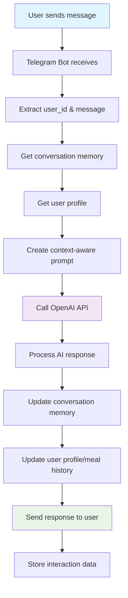

# NutritionGPT Coach v2.0 - Conversational AI Nutrition Assistant

## 🎯 **Vision & Overview**

Transform NutritionGPT from a simple meal planner into a sophisticated **conversational AI nutrition coach** with memory, proactive features, and personalized guidance. This version creates a true AI entity that learns, adapts, and grows with each user interaction.

## 🏗️ **Architecture Overview**

```
┌─────────────────────────────────────────────────────────────┐
│                    NUTRITIONGPT COACH v2.0                  │
├─────────────────────────────────────────────────────────────┤
│                                                             │
│  ┌─────────────┐    ┌─────────────┐    ┌─────────────┐     │
│  │   Telegram  │    │   AWS       │    │   OpenAI    │     │
│  │     Bot     │◄──►│   Lambda    │◄──►│     API     │     │
│  └─────────────┘    └─────────────┘    └─────────────┘     │
│         │                   │                   │           │
│         ▼                   ▼                   ▼           │
│  ┌─────────────┐    ┌─────────────┐    ┌─────────────┐     │
│  │   User      │    │ Conversation│    │ Nutrition   │     │
│  │  Messages   │    │   Memory    │    │ Knowledge   │     │
│  └─────────────┘    └─────────────┘    └─────────────┘     │
│                                                             │
│  ┌─────────────┐    ┌─────────────┐    ┌─────────────┐     │
│  │   User      │    │   Meal      │    │   AI Agent  │     │
│  │  Profiles   │    │  History    │    │   Tools     │     │
│  └─────────────┘    └─────────────┘    └─────────────┘     │
│                                                             │
└─────────────────────────────────────────────────────────────┘
```

## 📁 **File Structure**

```
NutritionGPT_app/
├── 🧠 Core AI Files
│   ├── nutrition_coach_v2.py          # Full LangChain implementation
│   ├── nutrition_coach_simple.py      # Simplified Lambda version
│   └── requirements_v2.txt            # LangChain dependencies
│
├── 🚀 Deployment & Infrastructure
│   ├── deploy_conversational.py       # v2.0 deployment script
│   ├── deploy_simple.py              # v1.0 deployment script
│   └── requirements_simple.txt       # Minimal dependencies
│
├── 📚 Documentation
│   ├── README_v2.md                  # This file
│   ├── FEATURE_ROADMAP.md            # Detailed feature roadmap
│   ├── ARCHITECTURE_DIAGRAMS.md      # Technical diagrams
│   └── CONVERSATION_EXAMPLES.md      # Example conversations
│
├── 🎯 Production Files (v1.0)
│   ├── lambda_function_simple.py     # Current production version
│   ├── quick_deploy.py              # Quick update script
│   └── VERSION.md                   # v1.0 release notes
│
└── 📋 Legacy Files
    ├── lambda_function_v2.py         # Original advanced version
    ├── bot_main.py                  # Original local bot
    └── ai_service.py                # Original AI service
```

## 🔄 **Data Flow & Conversation Process**



## 🧠 **Core Components**

### **1. Conversation Memory System**
```python
@dataclass
class ConversationMemory:
    user_id: str
    messages: List[Dict[str, str]]  # Chat history
    last_interaction: datetime      # Timestamp
```

**Features:**
- Remembers last 10 messages per user
- Context-aware responses
- Personalized follow-up questions
- Cross-session memory persistence

### **2. User Profile Management**
```python
@dataclass
class UserProfile:
    user_id: str
    name: str
    age: Optional[int]
    weight: Optional[float]
    height: Optional[float]
    goals: List[str]              # ["build_muscle", "lose_fat"]
    dietary_restrictions: List[str] # ["vegetarian", "gluten_free"]
    calorie_target: Optional[int]
    protein_target: Optional[float]
```

**Features:**
- Dynamic profile creation
- Goal tracking and updates
- Dietary preference management
- Calorie and macro targets

### **3. Meal Logging System**
```python
@dataclass
class MealEntry:
    user_id: str
    meal_type: str                # breakfast, lunch, dinner, snack
    foods: List[Dict[str, Any]]   # [{"name": "chicken", "calories": 200}]
    total_calories: int
    total_protein: float
    timestamp: datetime
```

**Features:**
- Natural language meal logging
- Automatic calorie estimation
- Macro tracking (protein, carbs, fats)
- Meal history analysis

### **4. AI Agent Tools (LangChain Version)**
```python
tools = [
    Tool("get_user_profile", "Get user's nutrition profile"),
    Tool("update_user_profile", "Update user preferences"),
    Tool("log_meal", "Log food intake with nutrition data"),
    Tool("get_meal_history", "Get recent meal history"),
    Tool("create_nutrition_plan", "Generate personalized meal plan"),
    Tool("get_nutrition_advice", "Provide personalized advice"),
    Tool("schedule_reminder", "Set up meal/hydration reminders")
]
```

## 💬 **Conversation Examples**

### **Initial Setup Flow**
```
User: "Hi! I want to start tracking my nutrition and build muscle"
Bot: "Welcome to your nutrition journey! 🎯 Let's set up your profile. 
     What's your current weight and height?"

User: "I'm 180 lbs, 6'0", 25 years old"
Bot: "Perfect! For muscle building, you'll need about 1.6-2.2g protein per kg. 
     That's roughly 130-180g protein daily. What's your activity level?"

User: "I work out 4 times a week"
Bot: "Excellent! I'll set your calorie target at 2,200-2,400 calories 
     with 150g protein. Want me to create a meal plan?"
```

### **Meal Logging Flow**
```
User: "I just ate grilled chicken with rice for lunch"
Bot: "✅ Logged your lunch! Estimated nutrition:
     • Grilled chicken (4 oz): 180 cal, 35g protein
     • Brown rice (1/2 cup): 110 cal, 2g protein  
     • Total: 290 calories, 37g protein

     You're doing great on protein! You've hit 37g so far today. 
     Your target is 150g - want suggestions for high-protein snacks?"
```

### **Proactive Coaching**
```
Bot: "Hey! 👋 It's been 4 hours since your last meal. 
     Time for a snack to keep your metabolism active!

     Based on your goals, I suggest:
     • Greek yogurt with berries (150 cal, 15g protein)
     • Handful of almonds (160 cal, 6g protein)
     • Protein shake (120 cal, 25g protein)

     What sounds good to you?"
```

## 🚀 **Deployment Options**

### **Option 1: Simplified Version (Recommended for Lambda)**
```bash
# Deploy the simplified conversational coach
python deploy_conversational.py
```

**Features:**
- ✅ Conversation memory
- ✅ User profiles
- ✅ Meal logging
- ✅ Personalized responses
- ✅ AWS Lambda compatible
- ✅ Minimal dependencies

### **Option 2: Full LangChain Version (Advanced)**
```bash
# Install LangChain dependencies
pip install -r requirements_v2.txt

# Deploy with advanced features
python deploy_conversational.py --advanced
```

**Additional Features:**
- 🔄 LangChain agent system
- 🧠 Vector database (Chroma)
- 🛠️ Function calling
- 📊 RAG (Retrieval Augmented Generation)

## 📊 **Feature Comparison**

| Feature | v1.0 | v2.0 Simple | v2.0 LangChain |
|---------|------|-------------|----------------|
| Basic Meal Planning | ✅ | ✅ | ✅ |
| Telegram Integration | ✅ | ✅ | ✅ |
| AWS Lambda Deployment | ✅ | ✅ | ✅ |
| Conversation Memory | ❌ | ✅ | ✅ |
| User Profiles | ❌ | ✅ | ✅ |
| Meal Logging | ❌ | ✅ | ✅ |
| Personalized Responses | ❌ | ✅ | ✅ |
| Proactive Messaging | ❌ | ✅ | ✅ |
| Nutrition Knowledge Base | ❌ | ✅ | ✅ |
| Context-Aware AI | ❌ | ✅ | ✅ |
| LangChain Agent System | ❌ | ❌ | ✅ |
| Vector Database | ❌ | ❌ | ✅ |
| Function Calling | ❌ | ❌ | ✅ |
| RAG System | ❌ | ❌ | ✅ |

## 🎯 **Implementation Strategy**

### **Phase 1: Foundation (Current v1.0)**
- ✅ Basic meal planning
- ✅ Telegram integration
- ✅ AWS Lambda deployment

### **Phase 2: Conversational AI (v2.0 Simple)**
- 🔄 Deploy simplified conversational coach
- 🔄 Test conversation memory
- 🔄 Validate user profiles
- 🔄 Implement meal logging

### **Phase 3: Advanced AI (v2.0 LangChain)**
- 📅 Add LangChain integration
- 📅 Implement vector database
- 📅 Add function calling
- 📅 Build comprehensive knowledge base

### **Phase 4: Proactive Features (Future)**
- ⏰ Scheduled reminders
- 📊 Progress analytics
- 🍽️ Smart meal planning
- 📱 Multi-modal input

## 🔧 **Technical Requirements**

### **Environment Variables**
```bash
TELEGRAM_BOT_TOKEN=your_telegram_bot_token
OPENAI_API_KEY=your_openai_api_key
```

### **AWS Lambda Configuration**
- **Runtime**: Python 3.12
- **Memory**: 256 MB (increased for AI processing)
- **Timeout**: 30 seconds
- **Handler**: `nutrition_coach_simple.lambda_handler`

### **Dependencies**
- **Simple Version**: `requests==2.31.0`
- **LangChain Version**: See `requirements_v2.txt`

## 🧪 **Testing**

### **Local Testing**
```python
from nutrition_coach_simple import NutritionCoach

# Initialize coach
coach = NutritionCoach(openai_api_key="your-key")

# Test conversation
response = coach.process_message("test_user", "Hi! I want to build muscle.")
print(response)
```

### **Deployment Testing**
```bash
# Test deployment script
python deploy_conversational.py

# Check CloudWatch logs for errors
# Test bot responses in Telegram
```

## 📈 **Performance Metrics**

- **Response Time**: < 3 seconds
- **Memory Usage**: ~64 MB (simple), ~128 MB (LangChain)
- **Concurrent Users**: Limited by Lambda concurrency
- **Data Persistence**: In-memory (Lambda), persistent storage needed for production

## 🚀 **Next Steps**

1. **Deploy v2.0 Simple**: `python deploy_conversational.py`
2. **Test Conversation Flow**: Try the example conversations
3. **Validate Features**: Test memory, profiles, meal logging
4. **Gather Feedback**: Monitor user interactions
5. **Plan v2.1**: Add proactive features and analytics

## 📞 **Support & Troubleshooting**

- **Deployment Issues**: Check `AWS_TROUBLESHOOTING_GUIDE.md`
- **Conversation Problems**: Review CloudWatch logs
- **Feature Requests**: See `FEATURE_ROADMAP.md`
- **Architecture Questions**: Check `ARCHITECTURE_DIAGRAMS.md`

---

**NutritionGPT Coach v2.0** - Transforming nutrition coaching with conversational AI! 🎯🧠 